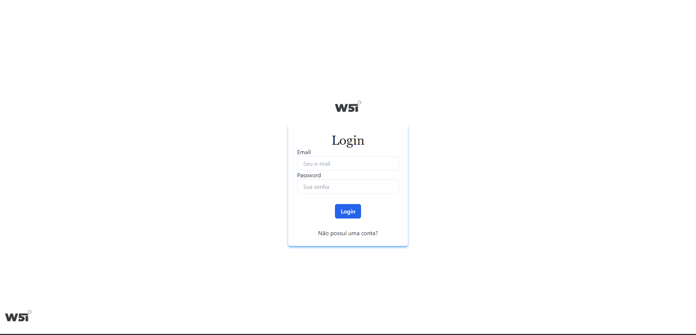
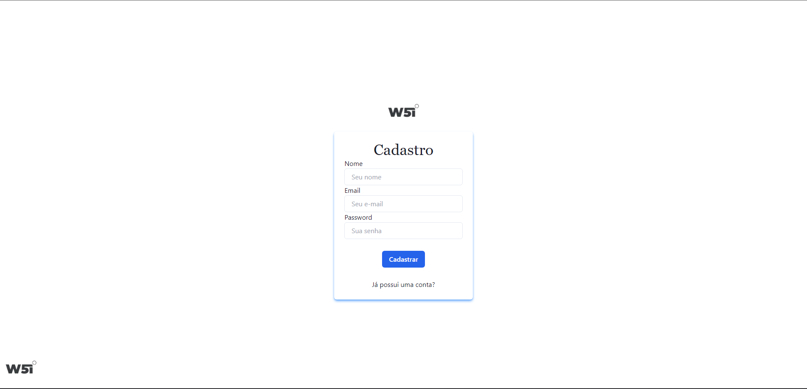
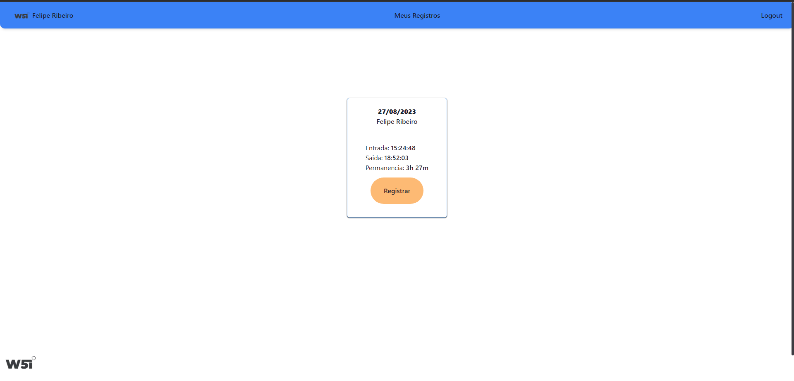
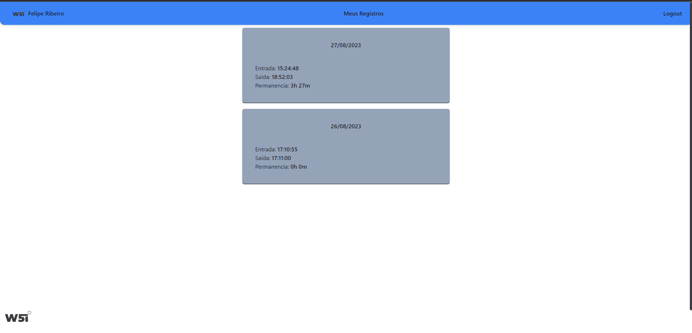

[](https://wakatime.com/badge/user/2f348d83-96c0-482b-ae6c-a687ad5fa937/project/b3b39043-ff93-4c0e-989e-347a993ea574)

# Desafio Técnico W5i

#### Teste de Estágio realizado, onde seria necessário implementar uma solução para liberação de acessos

## Operações

- [x] Cadastro da pessoa
- [x] Entrada (data e hora) - não pode dar entrada se a pessoa já deu entrada sem uma saída
- [x] Saída (data e hora) - não pode dar saída se não houver uma entrada anterior
- [x] Demonstrar usuario com suas entradas, saídas e tempo de permanência

## Stack utilizada

**Front-end:** React, Nextjs, TailwindCss

**Back-end:** Nodejs, NestJs, PrimaJs

**Database:** SQLite

## Rodando localmente

**Para rodar o projeto, certifique-se de que tenha o node-18 instalado em sua maquina!**
**Certifique-se também de que não haja nenhum serviço rodando na porta 3000 e 3001**

Clone o repositório

```bash
  git clone https://github.com/FelippeRibeiro/W5i-Acess-Point
```

Entre no diretório do projeto

```bash
  cd W5i-Acess-Point
```

Instalando as dependências do servidor e rodando

O servidor iniciará na porta 3001

```bash
  cd server

  npm run start:prod
```

Instalando as dependências do client e rodando (em terminal separado)

O client iniciará na porta 3000

```bash
  cd client

  npm run start:prod
```

Após iniciados, abre seu navegador de preferencia acessando: http://localhost:3000/cadastro

## Demonstração


## Screenshots








